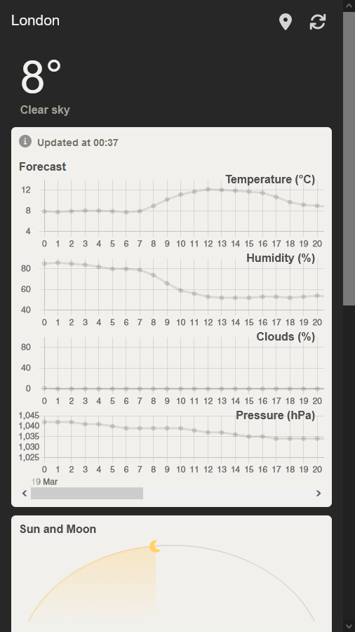

# Weather App Concept



This is a weather app concept built using React.

## Setup

```bash
# clone the repository
git clone git@github.com:jamesWalker55/weatherapp-2.git

# go into the new folder
cd weatherapp-2

# install the required modules
npm install

# start the live server
npm run start
```

## Component structure

The app is structured as follows:

- App (`App.js`)
    - Toolbar (`components/toolbar.js`)
        - Button (`components/parts/button.js`)
        - Button (`components/parts/button.js`)
    - WeatherDisplay (`weather-display.js`)
        - Header (`components/header.js`)
        - Forecast (`cards/forecast.js`)
            - HourlyChart (`cards/parts/hourly-chart.js`)
            - HourlyChart (`cards/parts/hourly-chart.js`)
            - HourlyChart (`cards/parts/hourly-chart.js`)
            - HourlyChart (`cards/parts/hourly-chart.js`)
        - SunAndMoonAlt (`cards/sun-and-moon-alt.js`)
            - Arc (`cards/sun-and-moon-alt.js`)
                - ArcIcon (`cards/sun-and-moon-alt.js`)
            - RiseSetInfo (`cards/parts/rise-set-info.js`)
            - RiseSetInfo (`cards/parts/rise-set-info.js`)
        - StarMap (`cards/star-map.js`)
        - DailyPicture (`cards/daily-picture.js`)
    - LocationSelect (`components/location-select.js`)
        - LocationOption (`components/location-select.js`)

## Design decisions

In this weather app, we have divided each section into cards. This allows each card to be modified independently of each other, and also lets developers easily extend this app by adding new cards.

All cards are contained by a WeatherDisplay component, which acts as a parent that passes API data from openweathermap to each card. This allows the API data to be changed independently of the cards, enabling features such as the location selector popup and refresh button.


